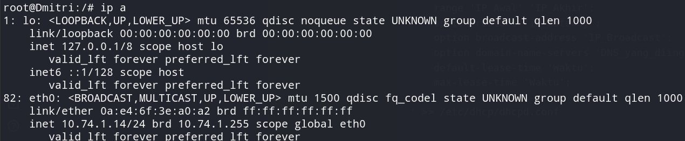
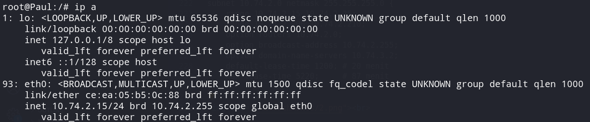
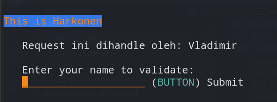
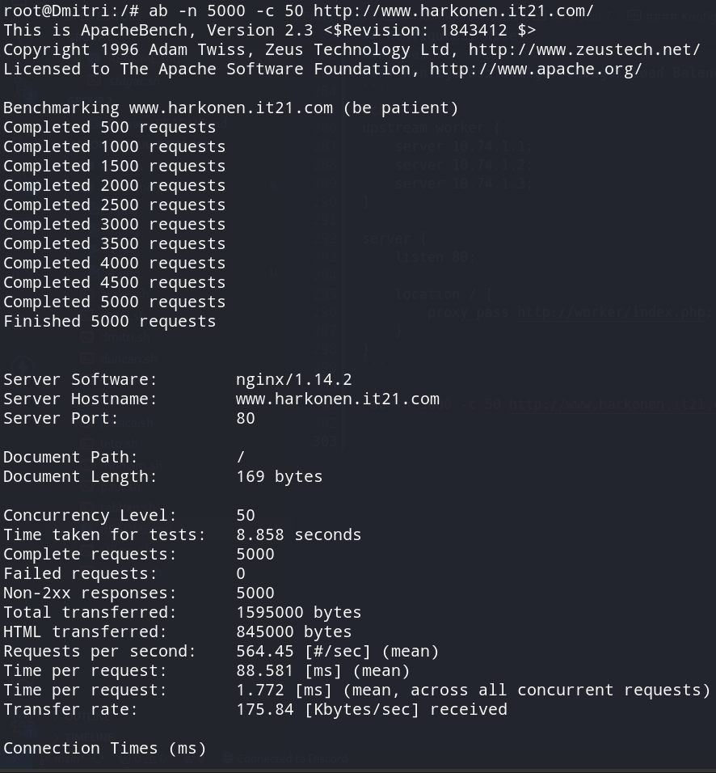
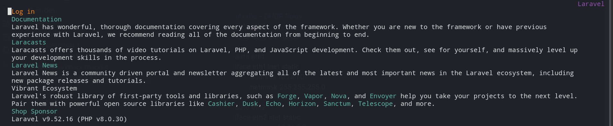

## Konfigurasi Node
### Arakis (DHCP Relay)
```
auto eth0
iface eth0 inet dhcp

auto eth1
iface eth1 inet static
	address 10.74.1.0
	netmask 255.255.255.0

auto eth2
iface eth2 inet static
	address 10.74.2.0
	netmask 255.255.255.0

auto eth3
iface eth3 inet static
	address 10.74.3.0
	netmask 255.255.255.0

auto eth4
iface eth4 inet static
	address 10.74.4.0
	netmask 255.255.255.0
```

### Mohiam (DHCP Server)
```
auto eth0
iface eth0 inet static
	address 10.74.3.1
	netmask 255.255.255.0
        broadcast 10.74.3.255  
	gateway 10.74.3.0
```

### Irulan (DNS Server)
```
auto eth0
iface eth0 inet static
	address 10.74.3.2
	netmask 255.255.255.0
        broadcast 10.74.3.255  
	gateway 10.74.3.0
```

### Chani (Database Server)
```
auto eth0 
iface eth0 inet static 
	address 10.74.4.1
	netmask 255.255.255.0  
        broadcast 10.74.4.255  
	gateway 10.74.4.0 
```

### Stilgar (Load Balancer)
```
auto eth0 
iface eth0 inet static 
	address 10.74.4.2
	netmask 255.255.255.0  
        broadcast 10.74.4.255  
	gateway 10.74.4.0 
```

### Leto (Laravel Worker)
```
auto eth0 
iface eth0 inet static 
	address 10.74.2.1
	netmask 255.255.255.0 
        broadcast 10.74.2.255   
	gateway 10.74.2.0 
```

### Duncan (Laravel Worker)
```
auto eth0 
iface eth0 inet static 
	address 10.74.2.2
	netmask 255.255.255.0 
        broadcast 10.74.2.255   
	gateway 10.74.2.0 
```

### Jessica (Laravel Worker)
```
auto eth0 
iface eth0 inet static 
	address 10.74.2.3
	netmask 255.255.255.0 
        broadcast 10.74.2.255   
	gateway 10.74.2.0 
```

### Vladimir (PHP Worker)
```
auto eth0 
iface eth0 inet static 
	address 10.74.1.1
	netmask 255.255.255.0
        broadcast 10.74.1.255  
	gateway 10.74.1.0 
```

### Rabban (PHP Worker)
```
auto eth0 
iface eth0 inet static 
	address 10.74.1.2
	netmask 255.255.255.0
        broadcast 10.74.1.255  
	gateway 10.74.1.0 
```

### Feyd (PHP Worker)
```
auto eth0 
iface eth0 inet static 
	address 10.74.1.3
	netmask 255.255.255.0
        broadcast 10.74.1.255  
	gateway 10.74.1.0 
```

### Dmitri (Client)
```
auto eth0
iface eth0 inet dhcp
```

### Paul (Client)
```
auto eth0
iface eth0 inet dhcp
```

### Soal 1
#### Setup Node Irulan untuk deklarasi domain
```
echo ' 
zone "atreides.it21.com" {
    type master;
    file "/etc/bind/sites/atreides.it21.com";
};

zone "harkonen.it21.com" {
    type master;
    file "/etc/bind/sites/harkonen.it21.com";
};
' > /etc/bind/named.conf.local

rm -rf /etc/bind/sites
mkdir /etc/bind/sites
cp /etc/bind/db.local /etc/bind/sites/atreides.it21.com
cp /etc/bind/db.local /etc/bind/sites/harkonen.it21.com

echo '
;
; BIND data file for local loopback interface
;
$TTL    604800
@       IN      SOA     atreides.it21.com. root.atreides.it21.com. (
                            2           ; Serial
                         604800         ; Refresh
                          86400         ; Retry
                        2419200         ; Expire
                         604800 )       ; Negative Cache TTL
;
@       IN      NS      atreides.it21.com.
@       IN      A       10.74.4.2       ; IP LB Stilgar
www     IN      CNAME   atreides.it21.com.' > /etc/bind/sites/atreides.it21.com

echo '
; BIND data file for local loopback interface
;
$TTL    604800
@       IN      SOA     harkonen.it21.com. root.harkonen.it21.com. (
                           3            ; Serial
                         604800         ; Refresh
                          86400         ; Retry
                        2419200         ; Expire
                         604800 )       ; Negative Cache TTL
;
@       IN      NS      harkonen.it21.com.
@       IN      A       10.74.4.2       ; IP LB Stilgar
www     IN      CNAME   harkonen.it21.com.' > /etc/bind/sites/harkonen.it21.com

echo 'options {
      directory "/var/cache/bind";

      forwarders {
              192.168.122.1;
      };

      allow-query{any;};
      auth-nxdomain no;
      listen-on-v6 { any; };
}; ' >/etc/bind/named.conf.options
```
### Soal 2
#### Setup Mohiam untuk IP Range node dengan switch Harkonen
```
subnet 10.74.1.0 netmask 255.255.255.0 {
    range 10.74.1.14 10.74.1.28;
    range 10.74.1.49 10.74.1.70;
    option routers 10.74.1.0;
    option broadcast-address 10.74.1.255;
    option domain-name-servers 10.74.3.2;
}
```

<br>

### Soal 3
#### Setup Mohiam untuk IP Range node dengan switch Atreides
```
subnet 10.74.2.0 netmask 255.255.255.0 {
    range 10.74.2.15 10.74.2.25;
    range 10.74.2.200 10.74.2.210;
    option routers 10.74.2.0;
    option broadcast-address 10.74.2.255;
    option domain-name-servers 10.74.3.2;
}
```
<br>

### Soal 4
Dikarenakan menggunakan DHCP relay, sehingga tidak membutuhkan port forwarding ke NAT demi client bisa mengakses internet
<br>

### Soal 5
#### Setup Mohiam untuk mengkonfigurasi lease-time client yang melalui house Harkonen dan Atreides
```
subnet 10.74.1.0 netmask 255.255.255.0 {
    range 10.74.1.14 10.74.1.28;
    range 10.74.1.49 10.74.1.70;
    option routers 10.74.1.0;
    option broadcast-address 10.74.1.255;
    option domain-name-servers 10.74.3.2;
    default-lease-time 300; # 5 menit
    max-lease-time 5220;     # 87 menit
}

subnet 10.74.2.0 netmask 255.255.255.0 {
    range 10.74.2.15 10.74.2.25;
    range 10.74.2.200 10.74.2.210;
    option routers 10.74.2.0;
    option broadcast-address 10.74.2.255;
    option domain-name-servers 10.74.3.2;
    default-lease-time 1200; # 20 menit
    max-lease-time 5220;     # 87 menit
}
```
### Soal 6
#### Konfigurasi untuk semua PHP Worker
```
echo 'nameserver 10.74.3.2' > /etc/resolv.conf
apt-get update
apt-get install -y wget
apt-get install -y unzip
apt-get install -y apache2
apt-get install apache2-utils -y
apt-get install -y php
apt-get install libapache2-mod-php7.3 -y
apt-get install lynx -y

service apache2 restart

wget --no-check-certificate "https://drive.google.com/uc?export=download&id=1lmnXJUbyx1JDt2OA5z_1dEowxozfkn30" -O harkonen.zip

unzip harkonen.zip
mv /root/modul-3/* /var/www/html
rm /var/www/html/harkonen.zip
cd
service apache2 restart
```
<br>

### Soal 7
#### Konfigurasi Stilgar sebagai Load Balancer
```
echo ' 
upstream worker {
    server 10.74.1.1;
    server 10.74.1.2;
    server 10.74.1.3;
}

server {
    listen 80;

    location / {
        proxy_pass http://worker/index.php;
    }
}
```

`ab -n 5000 -c 50 http://www.harkonen.it21.com/`

<br>

### Soal 8
#### Konfigurasi Algoritma Benchmark
```
echo ' 
upstream worker {
    server 10.74.1.1;
    server 10.74.1.2;
    server 10.74.1.3;
}

server {
    listen 80;

    location / {
        proxy_pass http://worker/index.php;
    }
} ' > /etc/nginx/sites-available/default

service nginx start

echo "=====nginx benchmark====="

ab -n 500 -c 50 http://10.74.4.2/

echo ' 
upstream worker {
    least_conn;
    server 10.74.1.1;
    server 10.74.1.2;
    server 10.74.1.3;
}

server {
    listen 80;

    location / {
        proxy_pass http://worker/index.php;
    }
} ' > /etc/nginx/sites-available/default

echo "=====nginx least connection====="
ab -n 500 -c 50 http://10.74.4.2/

echo ' 
upstream worker {
    ip_hash;
    server 10.74.1.1;
    server 10.74.1.2;
    server 10.74.1.3;
}

server {
    listen 80;

    location / {
        proxy_pass http://worker/index.php;
    }
} ' > /etc/nginx/sites-available/default

echo "=====nginx ip hash====="
ab -n 500 -c 50 http://10.74.4.2/

echo ' 
upstream worker {
    hash $request_uri consistent;
    server 10.74.1.1;
    server 10.74.1.2;
    server 10.74.1.3;
}

server {
    listen 80;

    location / {
        proxy_pass http://worker/index.php;
    }
} ' > /etc/nginx/sites-available/default

echo "=====nginx generic hash====="
ab -n 500 -c 50 http://10.74.4.2/

echo ' 
upstream worker {
    least_conn;
    server 10.74.1.1;
    server 10.74.1.2;
    server 10.74.1.3;
}

server {
    listen 80;

    location / {
        proxy_pass http://worker/index.php;
    }
} ' > /etc/nginx/sites-available/default
```

Detail dari benchmark dapat dilihat pada [Peta Spice](./Analisis/IT21_Spice.pdf)

### Soal 9
#### Konfigurasi 1-3 worker Benchmarking
```
echo "=====nginx least connection 3 Worker====="
ab -n 1000 -c 10 http://10.74.4.2/

echo ' 
upstream worker {
    least_conn;
    server 10.74.1.2;
    server 10.74.1.3;
}

server {
    listen 80;

    location / {
        proxy_pass http://worker/index.php;
    }
} ' > /etc/nginx/sites-available/default

echo "=====nginx least connection 2 Worker====="
ab -n 1000 -c 10 http://10.74.4.2/

echo ' 
upstream worker {
    least_conn;
    server 10.74.1.3;
}

server {
    listen 80;

    location / {
        proxy_pass http://worker/index.php;
    }
} ' > /etc/nginx/sites-available/default

echo "=====nginx least connection 1 Worker====="
ab -n 1000 -c 10 http://10.74.4.2/
```

Detail dari benchmark dapat dilihat pada [Peta Spice](./Analisis/IT21_Spice.pdf)

### Soal 10
#### Konfigurasi autentikasi
```
rm -rf /etc/nginx/supersecret
mkdir /etc/nginx/supersecret
htpasswd -c /etc/nginx/supersecret/htpasswd secmart

echo '
upstream worker {
    least_conn;    
    server 10.74.1.1;
    server 10.74.1.2;
    server 10.74.1.3;
}

server {
    listen 80;

    location / {
        proxy_pass http://worker/index.php;
        auth_basic "Restricted Content";
        auth_basic_user_file /etc/nginx/supersecret/htpasswd;
    }
}
```
### Soal 11
#### Konfigurasi proxy pass pada load balancer
```
location /dune {
        proxy_pass https://www.dunemovie.com.au/;
        proxy_set_header Host www.dunemovie.com.au;
        proxy_set_header X-Real-IP $remote_addr;
        proxy_set_header X-Forwarded-For $proxy_add_x_forwarded_for;
        proxy_set_header X-Forwarded-Proto $scheme;
    }
```

### Soal 12
#### Konfigurasi Load Balancer untuk limited IP access
```
upstream worker {
    least_conn;    
    server 10.74.1.1;
    server 10.74.1.2;
    server 10.74.1.3;
}

server {
    listen 80;

    location / {
        proxy_pass http://worker/index.php;
        auth_basic "Restricted Content";
        auth_basic_user_file /etc/nginx/supersecret/htpasswd;
        allow 10.74.1.37;
        allow 10.74.1.67;
        allow 10.74.2.203;
        allow 10.74.2.207;
        deny all;
    }
}
```

### Soal 13
#### Konfigurasi Database Server
```
echo "nameserver 10.74.3.2" > /etc/resolv.conf
apt-get update
apt-get install mariadb-server -y
service mysql start

echo '
[client-server]

!includedir /etc/mysql/conf.d/
!includedir /etc/mysql/mariadb.conf.d/

[mysqld]
skip-networking=0
skip-bind-address
' > /etc/mysql/my.cnf

echo '
[server]

[mysqld]

user                    = mysql
pid-file                = /run/mysqld/mysqld.pid
socket                  = /run/mysqld/mysqld.sock
#port                   = 3306
basedir                 = /usr
datadir                 = /var/lib/mysql
tmpdir                  = /tmp
lc-messages-dir         = /usr/share/mysql
 
bind-address            = 0.0.0.0

query_cache_size        = 16M

log_error = /var/log/mysql/error.log

expire_logs_days        = 10

character-set-server  = utf8mb4
collation-server      = utf8mb4_general_ci

[embedded]

[mariadb]

[mariadb-10.3]
' > /etc/mysql/mariadb.conf.d/50-server.cnf

service mysql restart

bash <<EOF
mysql -u root -p
DROP USER 'it21';
DROP DATABASE dbit21;
CREATE USER 'it21' IDENTIFIED BY 'passwordit21';
CREATE DATABASE dbit21;
GRANT ALL PRIVILEGES ON *.* TO 'it21';
FLUSH PRIVILEGES;
EOF
```

### Soal 14
#### Konfigurasi Laravel Worker
```
cd /var/www && git clone https://github.com/martuafernando/laravel-praktikum-jarkom
cd /var/www/laravel-praktikum-jarkom && composer update
cd /var/www/laravel-praktikum-jarkom && cp .env.example .env

echo '
APP_NAME=Laravel
APP_ENV=local
APP_KEY=
APP_DEBUG=true
APP_URL=http://localhost

LOG_CHANNEL=stack
LOG_DEPRECATIONS_CHANNEL=null
LOG_LEVEL=debug

DB_CONNECTION=mysql
DB_HOST=10.74.4.1
DB_PORT=3306
DB_DATABASE=dbit21
DB_USERNAME=it21
DB_PASSWORD=passwordit21

BROADCAST_DRIVER=log
CACHE_DRIVER=file
FILESYSTEM_DISK=local
QUEUE_CONNECTION=sync
SESSION_DRIVER=file
SESSION_LIFETIME=120

MEMCACHED_HOST=127.0.0.1

REDIS_HOST=127.0.0.1
REDIS_PASSWORD=null
REDIS_PORT=6379

MAIL_MAILER=smtp
MAIL_HOST=mailpit
MAIL_PORT=1025
MAIL_USERNAME=null
MAIL_PASSWORD=null
MAIL_ENCRYPTION=null
MAIL_FROM_ADDRESS="hello@example.com"
MAIL_FROM_NAME="${APP_NAME}"

AWS_ACCESS_KEY_ID=
AWS_SECRET_ACCESS_KEY=
AWS_DEFAULT_REGION=us-east-1
AWS_BUCKET=
AWS_USE_PATH_STYLE_ENDPOINT=false

PUSHER_APP_ID=
PUSHER_APP_KEY=
PUSHER_APP_SECRET=
PUSHER_HOST=
PUSHER_PORT=443
PUSHER_SCHEME=https
PUSHER_APP_CLUSTER=mt1

VITE_PUSHER_APP_KEY="${PUSHER_APP_KEY}"
VITE_PUSHER_HOST="${PUSHER_HOST}"
VITE_PUSHER_PORT="${PUSHER_PORT}"
VITE_PUSHER_SCHEME="${PUSHER_SCHEME}"
VITE_PUSHER_APP_CLUSTER="${PUSHER_APP_CLUSTER}"' > /var/www/laravel-praktikum-jarkom/.env

rm public/storage
cd /var/www/laravel-praktikum-jarkom && php artisan key:generate
cd /var/www/laravel-praktikum-jarkom && php artisan config:cache
cd /var/www/laravel-praktikum-jarkom && php artisan migrate
cd /var/www/laravel-praktikum-jarkom && php artisan db:seed
cd /var/www/laravel-praktikum-jarkom && php artisan storage:link
cd /var/www/laravel-praktikum-jarkom && php artisan jwt:secret
cd /var/www/laravel-praktikum-jarkom && php artisan config:clear
chown -R www-data.www-data /var/www/laravel-praktikum-jarkom/storage
```

#### Konfigurasi open listening port Leto
```
server {
    listen 8001;

    root /var/www/laravel-praktikum-jarkom/public;

    index index.php index.html index.htm;
    server_name _;

    location / {
            try_files $uri $uri/ /index.php?$query_string;
    }

    location ~ \.php$ {
      include snippets/fastcgi-php.conf;
      fastcgi_pass unix:/var/run/php/php8.0-fpm.sock;
    }

    location ~ /\.ht {
            deny all;
    }

    error_log /var/log/nginx/implementasi_error.log;
    access_log /var/log/nginx/implementasi_access.log;
}
```

#### Konfigurasi open listening port Duncan
```
server {
    listen 8002;

    root /var/www/laravel-praktikum-jarkom/public;

    index index.php index.html index.htm;
    server_name _;

    location / {
            try_files $uri $uri/ /index.php?$query_string;
    }

    location ~ \.php$ {
      include snippets/fastcgi-php.conf;
      fastcgi_pass unix:/var/run/php/php8.0-fpm.sock;
    }

    location ~ /\.ht {
            deny all;
    }

    error_log /var/log/nginx/implementasi_error.log;
    access_log /var/log/nginx/implementasi_access.log;
}
```

#### Konfigurasi open listening port Jessica
```
server {
    listen 8003;

    root /var/www/laravel-praktikum-jarkom/public;

    index index.php index.html index.htm;
    server_name _;

    location / {
            try_files $uri $uri/ /index.php?$query_string;
    }

    location ~ \.php$ {
      include snippets/fastcgi-php.conf;
      fastcgi_pass unix:/var/run/php/php8.0-fpm.sock;
    }

    location ~ /\.ht {
            deny all;
    }

    error_log /var/log/nginx/implementasi_error.log;
    access_log /var/log/nginx/implementasi_access.log;
}
```

Hasinya sebagai berikut:
<br>