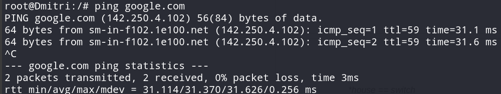

## Konfigurasi Node
### Arakis (DHCP Relay)
```
auto eth0
iface eth0 inet dhcp

auto eth1
iface eth1 inet static
	address 10.74.1.0
	netmask 255.255.255.0

auto eth2
iface eth2 inet static
	address 10.74.2.0
	netmask 255.255.255.0

auto eth3
iface eth3 inet static
	address 10.74.3.0
	netmask 255.255.255.0

auto eth4
iface eth4 inet static
	address 10.74.4.0
	netmask 255.255.255.0
```

### Mohiam (DHCP Server)
```
auto eth0
iface eth0 inet static
	address 10.74.3.1
	netmask 255.255.255.0
        broadcast 10.74.3.255  
	gateway 10.74.3.0
```

### Irulan (DNS Server)
```
auto eth0
iface eth0 inet static
	address 10.74.3.2
	netmask 255.255.255.0
        broadcast 10.74.3.255  
	gateway 10.74.3.0
```

### Chani (Database Server)
```
auto eth0 
iface eth0 inet static 
	address 10.74.4.1
	netmask 255.255.255.0  
        broadcast 10.74.4.255  
	gateway 10.74.4.0 
```

### Stilgar (Load Balancer)
```
auto eth0 
iface eth0 inet static 
	address 10.74.4.2
	netmask 255.255.255.0  
        broadcast 10.74.4.255  
	gateway 10.74.4.0 
```

### Leto (Laravel Worker)
```
auto eth0 
iface eth0 inet static 
	address 10.74.2.1
	netmask 255.255.255.0 
        broadcast 10.74.2.255   
	gateway 10.74.2.0 
```

### Duncan (Laravel Worker)
```
auto eth0 
iface eth0 inet static 
	address 10.74.2.2
	netmask 255.255.255.0 
        broadcast 10.74.2.255   
	gateway 10.74.2.0 
```

### Jessica (Laravel Worker)
```
auto eth0 
iface eth0 inet static 
	address 10.74.2.3
	netmask 255.255.255.0 
        broadcast 10.74.2.255   
	gateway 10.74.2.0 
```

### Vladimir (PHP Worker)
```
auto eth0 
iface eth0 inet static 
	address 10.74.1.1
	netmask 255.255.255.0
        broadcast 10.74.1.255  
	gateway 10.74.1.0 
```

### Rabban (PHP Worker)
```
auto eth0 
iface eth0 inet static 
	address 10.74.1.2
	netmask 255.255.255.0
        broadcast 10.74.1.255  
	gateway 10.74.1.0 
```

### Feyd (PHP Worker)
```
auto eth0 
iface eth0 inet static 
	address 10.74.1.3
	netmask 255.255.255.0
        broadcast 10.74.1.255  
	gateway 10.74.1.0 
```

### Dmitri (Client)
```
auto eth0
iface eth0 inet dhcp
```

### Paul (Client)
```
auto eth0
iface eth0 inet dhcp
```

### Soal 1
#### Setup Node Irulan untuk deklarasi domain
```
echo ' 
zone "atreides.it21.com" {
    type master;
    file "/etc/bind/sites/atreides.it21.com";
};

zone "harkonen.it21.com" {
    type master;
    file "/etc/bind/sites/harkonen.it21.com";
};
' > /etc/bind/named.conf.local

rm -rf /etc/bind/sites
mkdir /etc/bind/sites
cp /etc/bind/db.local /etc/bind/sites/atreides.it21.com
cp /etc/bind/db.local /etc/bind/sites/harkonen.it21.com

echo '
;
; BIND data file for local loopback interface
;
$TTL    604800
@       IN      SOA     atreides.it21.com. root.atreides.it21.com. (
                            2           ; Serial
                         604800         ; Refresh
                          86400         ; Retry
                        2419200         ; Expire
                         604800 )       ; Negative Cache TTL
;
@       IN      NS      atreides.it21.com.
@       IN      A       10.74.4.2       ; IP LB Stilgar
www     IN      CNAME   atreides.it21.com.' > /etc/bind/sites/atreides.it21.com

echo '
; BIND data file for local loopback interface
;
$TTL    604800
@       IN      SOA     harkonen.it21.com. root.harkonen.it21.com. (
                           3            ; Serial
                         604800         ; Refresh
                          86400         ; Retry
                        2419200         ; Expire
                         604800 )       ; Negative Cache TTL
;
@       IN      NS      harkonen.it21.com.
@       IN      A       10.74.4.2       ; IP LB Stilgar
www     IN      CNAME   harkonen.it21.com.' > /etc/bind/sites/harkonen.it21.com

echo 'options {
      directory "/var/cache/bind";

      forwarders {
              192.168.122.1;
      };

      allow-query{any;};
      auth-nxdomain no;
      listen-on-v6 { any; };
}; ' >/etc/bind/named.conf.options
```
### Soal 2
#### Setup Mohiam untuk IP Range node dengan switch Harkonen
```
subnet 10.74.1.0 netmask 255.255.255.0 {
    range 10.74.1.14 10.74.1.28;
    range 10.74.1.49 10.74.1.70;
    option routers 10.74.1.0;
    option broadcast-address 10.74.1.255;
    option domain-name-servers 10.74.3.2;
}
```

<br>

### Soal 3
#### Setup Mohiam untuk IP Range node dengan switch Atreides
```
subnet 10.74.2.0 netmask 255.255.255.0 {
    range 10.74.2.15 10.74.2.25;
    range 10.74.2.200 10.74.2.210;
    option routers 10.74.2.0;
    option broadcast-address 10.74.2.255;
    option domain-name-servers 10.74.3.2;
}
```
<br>

### Soal 4
Dikarenakan menggunakan DHCP relay, sehingga tidak membutuhkan port forwarding ke NAT demi client bisa mengakses internet
<br>

### Soal 5
#### Setup Mohiam untuk mengkonfigurasi lease-time client yang melalui house Harkonen dan Atreides
```
subnet 10.74.1.0 netmask 255.255.255.0 {
    range 10.74.1.14 10.74.1.28;
    range 10.74.1.49 10.74.1.70;
    option routers 10.74.1.0;
    option broadcast-address 10.74.1.255;
    option domain-name-servers 10.74.3.2;
    default-lease-time 300; # 5 menit
    max-lease-time 5220;     # 87 menit
}

subnet 10.74.2.0 netmask 255.255.255.0 {
    range 10.74.2.15 10.74.2.25;
    range 10.74.2.200 10.74.2.210;
    option routers 10.74.2.0;
    option broadcast-address 10.74.2.255;
    option domain-name-servers 10.74.3.2;
    default-lease-time 1200; # 20 menit
    max-lease-time 5220;     # 87 menit
}
```
### Soal 6
